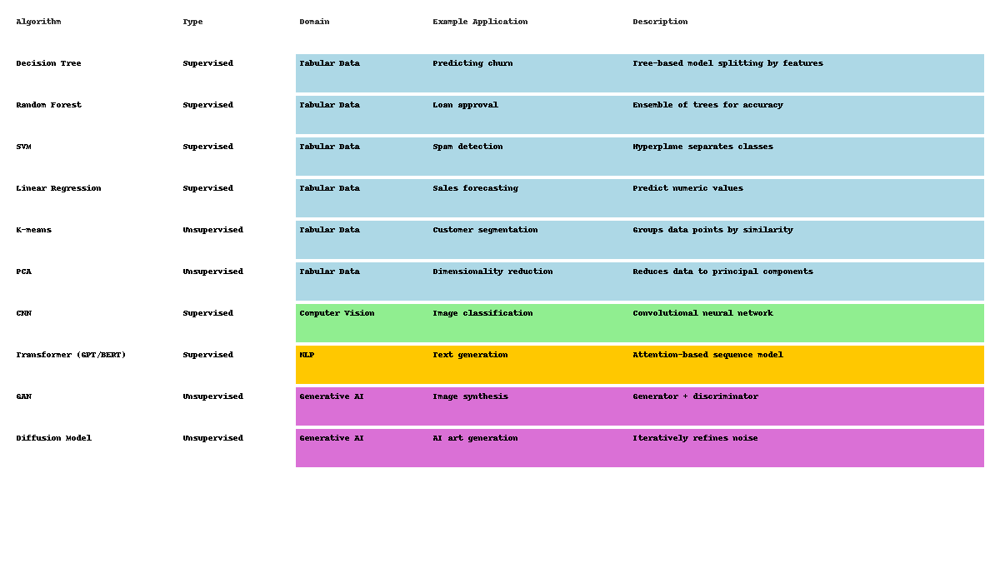

# AI/ML Portfolio: Machine Learning Algorithms

Welcome to my AI/ML portfolio. This artifact showcases **10 key machine learning algorithms**, their types, application domains, example use cases, and brief explanations. It serves as both a learning resource and a professional portfolio piece.

---

## Infographic Overview
The infographic below visually summarizes the algorithms:

---
## Reflections
You can read my reflections and learning experience [here](reflections.md).

## Algorithms Explained

### **Supervised Learning (Predictive Models with Labeled Data)**
- **Decision Tree:** Splits data into branches based on features to predict outcomes. Used for customer churn prediction.
- **Random Forest:** Ensemble of decision trees improving prediction accuracy. Example: Loan approval systems.
- **Support Vector Machine (SVM):** Finds a hyperplane that separates classes. Example: Spam email detection.
- **Linear Regression:** Predicts numeric outcomes from input features. Example: Sales forecasting.

### **Unsupervised Learning (Discovering Patterns Without Labels)**
- **K-means Clustering:** Groups similar data points together. Example: Customer segmentation.
- **Principal Component Analysis (PCA):** Reduces high-dimensional data into principal components. Example: Dimensionality reduction for visualization.

### **Computer Vision**
- **Convolutional Neural Networks (CNNs):** Detect patterns in images for classification and detection. Example: Image classification tasks.

### **Natural Language Processing (NLP)**
- **Transformer Models (GPT/BERT):** Use attention mechanisms for sequence modeling, text classification, and generation. Example: Chatbots, sentiment analysis.

### **Generative AI**
- **Generative Adversarial Networks (GANs):** Generate realistic images or content using a generator and discriminator network. Example: AI-generated images.
- **Diffusion Models:** Iteratively refine noise to generate high-quality content. Example: AI art generation.

---

## Learning Outcomes
By creating this portfolio, I have learned to:
- Categorize algorithms by type and domain.
- Understand practical applications for each algorithm.
- Communicate AI concepts visually and effectively.
- Showcase professional skills through a portfolio artifact.

This portfolio artifact demonstrates both technical knowledge and the ability to create clear, visually appealing educational resources in AI/ML.
